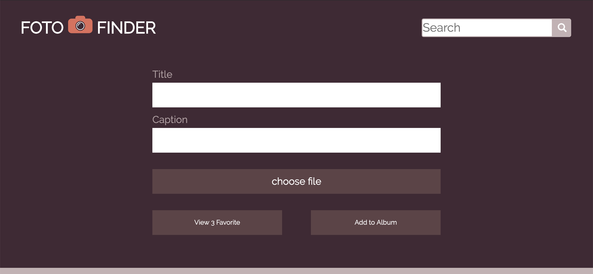
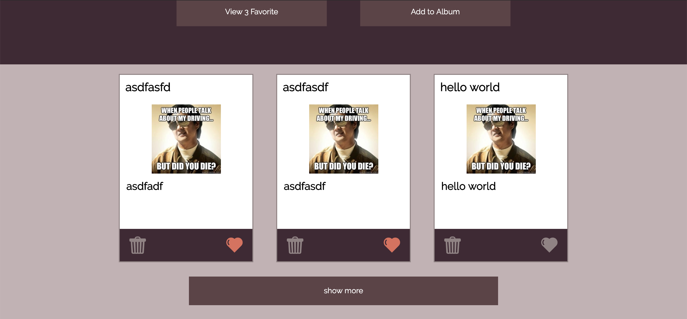
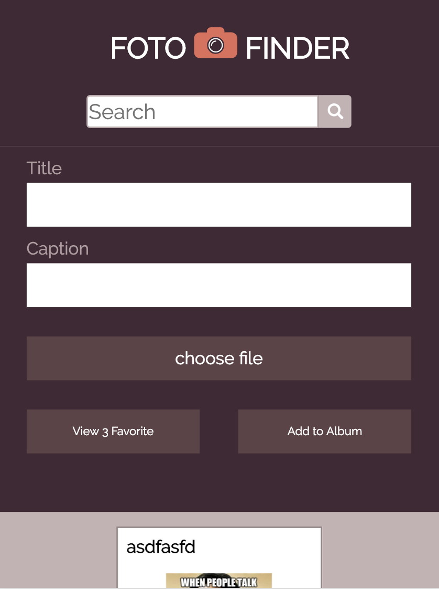

# Fotofinder

## Original photo

## Screenshot of my site

#### top of site

#### bottom of site

#### site seen in mobile/ when it reaches 420px width

## Synopsis
This project is to create a site that can save a persons image with the functionality to save it to localstorage, edit the post when already created, delete post, favorite post, and show more or less. 

## Built With
* CSS
* HTML
* Javascript

## Original Assignment - Turing MOD1
Fotofinder

#### Specifications

#### Base Requirements 
* Create the Html, CSS, and two Javascript files calling them index.html, style.css, main.js, and photo.js.
* The site must be responsive down to a mobile phone (320px width).
* site must have the require inputs
* post must be able to save to local storage.
* post must be able to delete from the dom and localstorage
* content on made post must be editable 
* favorite functionality must work

#### Submission Details
* create and repo on Github.
* include a README.md that provides a overview of project.
* Push final work to Github
